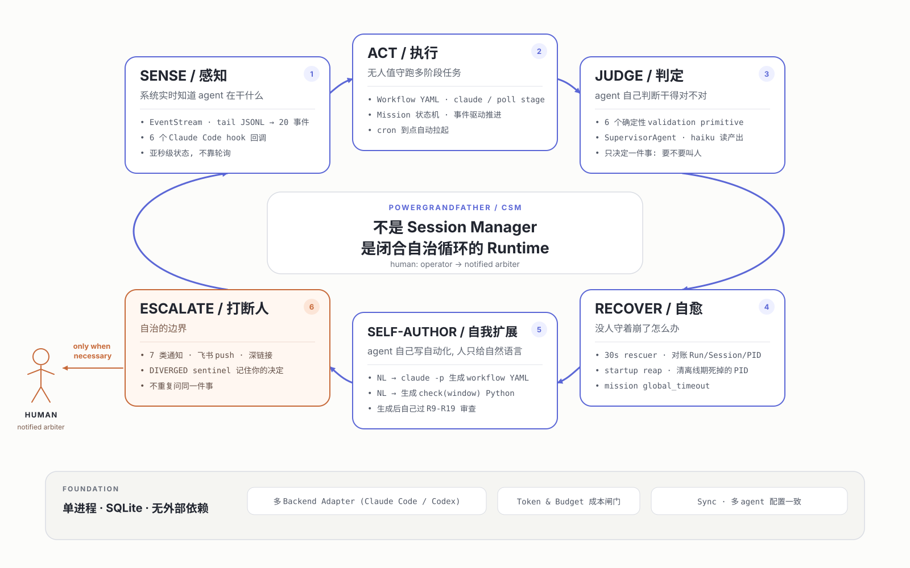

# PowerGrandFather — LLM-oriented brief

Optimized for language-model comprehension: dense, structured, no marketing.
See `README.md` for the human-facing feature tour and `docs/architecture.md`
for diagrams.

> **This document doubles as an autonomous-install manifest.** §0 below
> is written so that an LLM agent given a fresh checkout + shell access
> can bring CSM from clone → running without human help. Every step has
> a verification command; every likely failure has a documented recovery.

**Last verified against the code: 2026-08-23.** When you change a
subsystem, update the matching section here — this file is load-bearing
for agents working on the repo, and a stale line here becomes a wrong
edit downstream.

---

## 0. Autonomous bootstrap (execute in order)

**Preconditions to check first — abort with a specific message if any fail:**

```bash
python3 --version | grep -E 'Python 3\.(1[1-9]|[2-9][0-9])' || \
  { echo "ABORT: Python 3.11+ required" >&2; exit 1; }
node --version | grep -E 'v(1[8-9]|[2-9][0-9])' || \
  { echo "ABORT: Node.js 18+ required" >&2; exit 1; }
command -v conda >/dev/null || \
  { echo "ABORT: conda not installed. Install miniconda from https://docs.conda.io/en/latest/miniconda.html and re-run." >&2; exit 1; }
[ -f pyproject.toml ] && grep -q '^name = "csm"' pyproject.toml || \
  { echo "ABORT: run from PowerGrandFather repo root (pyproject.toml with name='csm' missing)" >&2; exit 1; }
```

**Install recipe (idempotent — safe to re-run):**

```bash
# 1. Create + activate conda env. Skip creation if csm exists.
conda env list | grep -qE '^\s*csm\s' || conda create -n csm python=3.11 -y
# `source activate` because `conda activate` needs shell hook init in non-interactive shells:
source "$(conda info --base)/etc/profile.d/conda.sh"
conda activate csm

# 2. Install backend. Retry with mirror if the first attempt fails on
# internal devpi (common for pytest-asyncio / mypy resolution).
pip install -e ".[dev]" || \
  pip install -e ".[dev]" -i https://pypi.tuna.tsinghua.edu.cn/simple

# 3. Apply migrations.
alembic upgrade head

# 4. Build frontend (must produce frontend/dist/index.html).
(cd frontend && npm ci && npm run build)

# 5. Start (background). start.sh writes csm.pid + csm.log.
./scripts/start.sh
sleep 3   # let uvicorn bind
```

**Verification — all four must return `OK`:**

```bash
# a) uvicorn process alive
kill -0 "$(cat csm.pid)" 2>/dev/null && echo "OK: pid alive" || echo "FAIL: pid dead — read csm.log"

# b) health endpoint reachable (X-CSM-Client header is mandatory on /api/*)
curl -sf http://localhost:8000/api/health -H 'X-CSM-Client: 1' >/dev/null \
  && echo "OK: api" || echo "FAIL: api unreachable"

# c) frontend served (SPA index present)
curl -sf http://localhost:8000/ | grep -q 'id="app"' \
  && echo "OK: spa" || echo "FAIL: spa 404 — rebuild with cd frontend && npm run build"

# d) migration chain is at head, no orphan revisions
alembic current | tail -1 | grep -qi '(head)' \
  && echo "OK: alembic head" || echo "FAIL: alembic not at head"
```

`GET /api/health` returns `{"status": "ok"|"degraded", "tasks": {...}}`.
`degraded` is normal on a fresh install — it just means an optional
background task (usage probe, sync tick) is not running.

**Common install failures → recovery:**

| Symptom | Diagnostic | Fix |
|---|---|---|
| `pip install` hangs / SSL error on internal PyPI | `curl -I https://pypi.org/` fails | Add `-i https://pypi.tuna.tsinghua.edu.cn/simple` |
| `alembic upgrade head` says "Multiple head revisions" | `alembic heads` shows >1 | `alembic merge -m "merge" <rev1> <rev2>` then `alembic upgrade head` |
| Port 8000 already in use | `ss -tlnp \| grep :8000` | `CSM_PORT=8001 ./scripts/start.sh` |
| Backend refuses to start, names another PID | Second instance on the same DB | See §16.1 — use a different `CSM_DB_PATH` |
| `npm run build` errors "vite: command not found" | `frontend/node_modules/` empty | `cd frontend && rm -rf node_modules package-lock.json && npm install` |
| `/api/*` works but `/` returns 404 | `frontend/dist/index.html` missing | Re-run step 4 (build frontend) |
| `alembic` command not found | `pip install -e .` didn't complete | Ensure conda env is activated; rerun step 2 |
| `pytest` burns Claude tokens spawning `claude` | Test spawn hits real CLI | Set `CSM_CLAUDE_ARGV='bash -i'` before running pytest |
| TLS cert missing / browser refuses connect | `secrets/csm-cert.pem` absent | Either run `./scripts/gen-cert.sh` or use plain `http://localhost:8000` |
| Migration seed for `lark_settings` fails on legacy DB | Existing SQLite has old schema | `mv csm.db csm.db.bak && alembic upgrade head` (LOSES DATA — fresh installs only) |

**Post-install sanity actions (optional but recommended):**

```bash
# 1. Create a shell-backed session (avoids burning Claude tokens for validation)
export CSM_ALLOW_ARBITRARY_ARGV=1
./scripts/stop.sh && ./scripts/start.sh && sleep 3

curl -sf -X POST http://localhost:8000/api/sessions \
  -H 'X-CSM-Client: 1' -H 'Content-Type: application/json' \
  -d '{"cwd":"/tmp","argv":["bash","-i"],"title":"smoke-test"}' | \
  tee /tmp/csm_smoke.json

SID=$(grep -oE '"id":"[^"]+"' /tmp/csm_smoke.json | head -1 | cut -d'"' -f4)
echo "created session $SID"

# 2. Verify it appears in the list
curl -sf http://localhost:8000/api/sessions -H 'X-CSM-Client: 1' | \
  grep -q "\"$SID\"" && echo "OK: session listed"

# 3. Clean up (DELETE blocks up to 15s — SIGINT→TERM→KILL)
curl -sf -X DELETE http://localhost:8000/api/sessions/$SID -H 'X-CSM-Client: 1' \
  --max-time 20 && echo "OK: session killed"
```

---

## 1. What it is

**PowerGrandFather** (a.k.a. **CSM** — Claude Session Manager) is a
**single-user local web console** that acts as a runtime for parallel
CLI coding agents (Claude Code, Codex CLI): sessions, multi-stage
automation, token accounting, notifications, and multi-agent config
sync.

**Deployment shape**: **one** FastAPI process + **one** Vue 3 SPA +
**one** SQLite file. No Redis, no Postgres, no message broker.
Rationale in `docs/decisions/0002-single-process-monolith.md`.

Assume a single physical operator on `localhost`. There is **no
permission model and no multi-tenant isolation** — that is explicitly
out of scope, not an oversight.

The design intent is a closed loop rather than a dashboard: sense what
agents are doing (§5, §6) → run multi-stage work unattended (§10) →
have the work judged mechanically and then by a model (§10.4) → recover
without a human when something dies (§11) → escalate to the human only
when a decision is genuinely required (§9).



---

## 2. Code layout

Backend package: `backend/csm/` (imports use `csm.*`; `pyproject.toml`
sets `where=["backend"]` — do not import as `backend.csm`).

```
backend/csm/
├── main.py                # FastAPI app, lifespan orchestration, middleware
├── config.py              # Pydantic settings (CSM_* env prefix)
├── db.py                  # async engine / sessionmaker
├── api/                   # HTTP routers, one file per module
├── core/                  # EventStream, NotificationBus, single_instance, paths, perf_log
├── backends/              # CLI adapter protocol + registry + claude/ + codex/
├── modules/               # Business logic — see table below
├── adapters/              # External-world I/O: claude_subprocess,
│                          #   jsonl_tail, inapp_sink, lark_sink
└── models/                # SQLAlchemy ORM (StrEnum discriminators)

frontend/src/              # Desktop SPA (views / components / api / composables / stores)
mobile/                    # Independent mobile PWA served at /m/ + optional Android APK
alembic/versions/          # Migration chain (single head)
tasks/*.workflow.yaml      # Workflow definitions
docs/                      # PRD / architecture / USAGE / ADRs / backends
scripts/                   # start / stop / restore_backup / seed_demo / shoot_docs
```

`backend/csm/modules/` contents:

| Dir | Owns |
|---|---|
| `session_manager/` | PTY fork, ring buffer, orphan reaping, spawn argv, env layering |
| `workflow/` | Spec schema, loader, orchestrator (mission state machine), engine + primitives, reviewer, `authoring/` |
| `automation/` | `AutomationRunner` (finalizes stage runs), APScheduler cron wrapper |
| `token/` | Aggregator, rollup, trend, budget, `agent_alert/`, usage probe/poller |
| `agent/` | AgentDefinition store, conversations, JSONL fast-tail, message router |
| `supervisor/` | Post-mission LLM review |
| `sync/` | Multi-agent config sync v2 (agent, orchestrator, scheduler, sentinels, state) |
| `worktime/` | Human vs agent time accounting |
| `ports/` | `ss -tlnp` scanner + registry |

---

## 3. Lifespan and subsystem order

`main.py::lifespan()` acquires the single-instance DB lock **first**,
then constructs subsystems in this order (teardown reverses):

```
single-instance flock on <db_path>.lock
 → AdapterRegistry (build_default_registry; probes sync capabilities)
 → EventStream
 → SessionManager           (startup_reap_orphans, then background loops)
 → TokenAggregator, ToolLogger
 → BudgetEvaluator
 → AgentAlertEvaluator      (csm.modules.token.agent_alert;
                             legacy AlertEvaluator retired 2026-07-10)
 → InAppSink / LarkSink
 → NotificationBus          (subscribes to EventStream)
 → AgentStore / AgentConvManager
 → AutomationRunner
 → AutomationScheduler      (cron; wired to orchestrator)
 → WorkflowLoader           (loads tasks/*.workflow.yaml)
 → WorkflowOrchestrator     (mission state machine + rescuer loop)
 → SupervisorAgent          (subscribes to SESSION_ENDED for AUTO sessions)
 → RollupWorker
 → UsagePoller / UsageScheduler
 → SyncService / DriftPoller / SyncAgent / SyncOrchestrator
```

All subsystems attach to `app.state.*`. Access from API handlers via
`request.app.state.<name>`. **Do not introduce module-level singletons**
for new subsystems — follow the lifespan pattern so tests can inject
mocks without patching import-time state.

---

## 4. Data model (essential rows)

Column names below are the **actual ORM attribute names**. Getting these
wrong is the most common way an LLM edit fails to import.

| Table | Key fields | Notes |
|---|---|---|
| `session` | `id`, `title`, `type: SessionType`, `cwd`, `status: SessionStatus`, `pid`, `external_session_id`, `agent`, `rollout_path`, `superseded_by`, `unread_count`, `current_tool`, `last_assistant_msg`, `session_project_id`, `pinned`, `manual_unread`, `archived_at` | One table for all three session kinds. `external_session_id` = CLI-assigned uuid; reconciliation is partial (§14). |
| `notification` | `type: NotificationType`, `session_id?`, `title`, `body`, `read_at?`, `dismissed_at?`, `channels_sent`, `notif_metadata` (DB column is `metadata`) | In-app + Lark share the same rows. |
| `workflow_definition` | `name`, `description`, `file_path`, **`yaml_content`**, `compiled_rules`, `review_status: WorkflowReviewStatus`, `review_report`, `project_id`, `archived_at` | Loaded from `tasks/*.workflow.yaml` by `WorkflowLoader`. |
| `mission` | **`workflow_def_id`**, **`parameters`**, `workspace_path`, `status: MissionStatus`, `current_stage`, `failure_reason`, `audit_log` | Concrete execution of a workflow. |
| `stage_execution` (Python class `Run`, alias `StageExecution`) | `mission_id`, **`stage_name`**, `session_id`, `status: RunStatus`, `parameters`, `review_note`, `exit_code` | Per-stage record. Formerly the `run` table; renamed by the P0-P4 migration. |
| `agent_definition` | `name`, `display_name`, `icon`, `description`, `cwd`, `prompt_source`, `prompt_cached`, `disable_skills` | Agent Deck templates. |
| `agent_conversation` | `agent_def_id`, `session_id`, `title`, `ended_at` | Links a CHAT_AGENT session to a template. |
| `budget` | `name`, `enabled`, `scope_type`, `scope_value`, `period`, **`token_limit`**, **`cost_limit`**, `warn_pct`, `action: BudgetAction`, `notify_channel`, `cooldown_minutes`, `last_state` | There is **no** `hard_pct` — severity is `warn_pct` + `action`. |
| `agent_alert_rule` | `name`, `enabled`, `nl_description`, `threshold_spec`, `check_script`, `poll_interval_sec`, `cooldown_sec`, `channels`, `escalate`, `last_fired_at`, `last_error`, `snoozed_until` | NL-authored token alerts (§13.2). |
| `raw_token_event` | `ts`, `external_session_id`, `project_path`, `model`, `input_tokens`, `cache_creation_tokens`, `cache_read_tokens`, `output_tokens`, `estimated_cost_usd`, `source`, `agent`, `csm_session_id` | Raw usage rows; TTL-pruned (`raw_event_retention_days`). |
| `tool_invocation` | same token columns + `tool_name` | Per-tool attribution. |
| `hourly_rollup` | aggregated buckets | So history queries don't scan raw events. |
| `usage_snapshot` | `agent`, `session_pct`, `week_pct`, `tier`, `raw_pane` | Subscription-plan probe output (real numbers, not estimates). |
| `work_interval` | `kind: WorkIntervalKind`, `session_id?`, `start_ts`, `end_ts?`, `source: WorkIntervalSource` | Worktime accounting (§15). |
| `instruction` / `mcp_server` / `skill` | `name`, body/config fields, `share_scope` / `enabled_for`, `origin`, **`last_synced_hashes`** | Sync v2 resources (§12). |
| `sync_config` | `module`, `enrolled_agents`, `enabled`, `sync_mode`, `tick_interval_minutes`, `resource_allowlist` | Per-module sync settings. |
| `sync_agent_run` / `sync_activity` / `fanout_ledger` / `pending_decision` / `drift_record` | tick + fanout bookkeeping | See §12. |
| `project` / `session_project` | user-managed grouping | `project` groups workflows; `session_project` groups sessions. |
| `port` | `port`, `pid?`, `cmd?`, `status: PortStatus` | Populated by the `ss -tlnp` scanner. |

Retired in P0-P4 (do not write code assuming these exist): `TaskDefinition`,
`ScheduleEntry.task_def_id`, `Run.task_def_id`, `/api/tasks/*`.

---

## 5. EventStream — the pub/sub spine

`backend/csm/core/event_stream.py` tails `~/.claude/projects/**/*.jsonl`
(and codex rollouts) every 5s and derives typed events. It is
**in-memory pub/sub only** — events are NOT persisted by EventStream.

Persistence is the consumer's responsibility. `NotificationBus`,
`TokenAggregator`, `AutomationRunner`, `WorkflowOrchestrator`,
`SupervisorAgent` each own their storage.

### Event types — exactly 20 (`csm.core.events.EventType`)

```
session.started              tool.invoked                usage.recorded
session.ended                tool.completed              api.error
session.crashed              session.tool_progress       rate_limit.hit
session.idle                 session.interrupted         token.alert_triggered
session.waiting_input        message.user_sent           token.budget_breached
session.waiting_auth         message.assistant_done      ports.conflict_detected
supervisor.review_requested  mission.ended
```

JSONL parsing runs in a **thread pool**, not on the event loop — a large
transcript would otherwise freeze every request for seconds (this was a
real incident; see §16.9).

### Adding a new event type

1. Add enum + payload dataclass in `core/events.py`.
2. Wire derivation in `core/event_stream.py`.
3. Update any subscriber that should react.
4. Add fixture data in `tests/fixtures/jsonl/` + a unit test that feeds
   it through `EventStream`.

---

## 6. Hooks — the low-latency sensing path

JSONL tailing has a 5s floor. Claude Code **hooks** give sub-second
state, so every spawned claude session is started with `--settings`
pointing all six hook events at `POST /api/hooks/{sid}`
(`backend/csm/api/hooks.py`). The body is the official Claude Code hook
payload; dispatch is by `hook_event_name`.

| Hook | What CSM does |
|---|---|
| `SessionStart` | Mark session ready / `waiting_input`; bind `external_session_id` (guarded — see below) |
| `UserPromptSubmit` | User sent a prompt → back to `running` |
| `PreToolUse` | Record `current_tool`; drives the "agent working" indicator |
| `Notification` | Permission prompt → `waiting_auth` + a notification row |
| `Stop` | Assistant turn finished → `waiting_input`; emits `MESSAGE_ASSISTANT_DONE` |
| `SessionEnd` | Terminal — the only hook allowed to leave a session `exited` / `orphaned` |

Response body is `{}` (no permission override). If you ever want to
programmatically block a tool, return the
`{"hookSpecificOutput": {...}}` shape Claude Code expects.

**Non-obvious behaviors, all of which exist because of a real bug:**

- **`SessionEnd` is not always the end.** New Claude versions fire
  `SessionEnd(reason="clear")` on `/clear` — the PTY stays alive and
  immediately re-inits with a `SessionStart`. Dispatch is gated on
  `reason` / `source`; treating every `SessionEnd` as terminal made
  sessions vanish from the UI.
- **`SessionStart` will not clobber a healthy `external_session_id`.**
  A rotation guard refuses the overwrite unless the existing binding is
  already stale, otherwise a re-init rebinds the row to the wrong JSONL.
- **Any non-`SessionEnd` hook clears `ended_at`** — the process is
  demonstrably alive, so a previously-recorded end must be wrong.
- **Fan-out happens off the hook response.** EventStream fan-out used to
  run inline and made the `Stop` hook take 9-13s, which blocks claude
  itself. Keep the handler's critical path short.
- **Hook and JSONL both report the same turn**, so notification creation
  cross-deduplicates by source. One turn → one notification.

---

## 7. State machines

### SessionStatus (8 values — there is no `KILLED`)

```
STARTING → RUNNING ⇄ IDLE
              ⇄ WAITING_INPUT   (Stop hook: awaiting user prompt)
              ⇄ WAITING_AUTH    (Notification hook: permission prompt)
              → EXITED           (clean exit)
              → CRASHED          (nonzero exit / signal)
              → ORPHANED         (reaper found a row with no live pid)
```

A user-initiated stop lands in `EXITED` or `CRASHED` depending on how the
child died — it is not a distinct state.

### MissionStatus

```
PENDING → RUNNING → SUCCEEDED | FAILED | CANCELLED
                  → PAUSED (manual)
```

Transitions are enforced by `_check_transition`; an illegal one raises
`InvalidMissionStateTransition` rather than silently writing.

### RunStatus (`stage_execution`)

```
PENDING → RUNNING → SUCCEEDED | FAILED | NEEDS_REVIEW
```

---

## 8. HTTP surface

All routes are `/api/*` except:
- `/ws/*` — WebSockets (session terminal, agent chat)
- `/metrics` — Prometheus

### Router-to-prefix map

| Prefix | Router file | Verbs (sample) |
|---|---|---|
| `/api/health` | `main.py` | `GET` — `{status, tasks}` |
| `/api/sessions` | `api/sessions.py` | `GET /`, `POST /`, `GET /{sid}`, `DELETE /{sid}`, `POST /purge-history`, `GET /{sid}/changes`, `GET /{sid}/changes/diff-view`, `GET /{sid}/history`, `WS /{sid}/attach` |
| `/api/tokens` | `api/tokens.py` | `GET /aggregate`, `GET /trend`, `GET /top`, `GET /observations` |
| `/api/tokens/agent-alerts` | `api/agent_alerts.py` | `GET /`, `POST /`, `PATCH /{rid}`, `DELETE /{rid}`, `POST /generate`, `POST /from-preset`, `GET /presets`, `POST /{rid}/snooze` |
| `/api/budgets` | `api/budgets.py` | `GET /`, `POST /`, `PATCH /{bid}`, `DELETE /{bid}`, `GET /status` |
| `/api/pricing` | `api/pricing.py` | model → USD lookup |
| `/api/notifications` | `api/notifications.py` | `GET /`, `GET /unread-summary`, `POST /{nid}/read`, `POST /mark-session-read/{sid}` |
| `/api/hooks/{sid}` | `api/hooks.py` | Hook receiver (loopback-only, exempt from the client header) |
| `/api/backup` | `api/backup.py` | `POST /create`, `GET /list`, `GET /download/{name}`, `DELETE /{name}` |
| `/api/fs` | `api/fs.py` | `GET /browse`, `GET /recent-cwds` |
| `/api` (agents) | `api/agents.py` | `GET /agents`, `GET /agents-overview`, `POST /agents`, `PATCH /agents/{id}`, `POST /agents/{id}/spawn`, `POST /agents/conversations/{cid}/messages`, `POST /agents/conversations/{cid}/interrupt`, `WS /ws/agents/conversations/{cid}` |
| `/api` (workflows) | `api/workflows.py` | `GET /workflows`, `PUT /workflows/{name}`, `POST /workflows/reload`, `POST /workflows/clarify`, `POST /workflows/generate`, `POST /workflows/{name}/preview`, `POST /workflows/{name}/edit-with-agent`, `POST /workflows/{name}/debug-session`, `POST /workflows/{name}/archive` |
| `/api/missions` | `api/missions.py` | `POST /launch`, `GET /`, `GET /{mid}`, `POST /{mid}/cancel`, `POST /{mid}/retry`, `POST /prune-terminal` |
| `/api/automation` | `api/automation.py` | `GET/POST /schedules`, `PATCH /schedules/{sid}`, `POST /schedules/{sid}/enable`, `GET /runs`, `POST /runs/{id}/retry` |
| `/api/files` | `api/files.py` | `GET /preview`, `GET /raw`, `GET /inline/{b64_dir}/{filename:path}`, `GET /oss-redirect`, `GET /recent/{sid}` |
| `/api/events/stream` | `api/events.py` | SSE fan-out |
| `/api/sync` | `api/sync.py` | See §12.4 |
| `/api/worktime` | `api/worktime.py` | `POST /heartbeat`, `GET /live` |
| `/api/settings/proxy-env` | `api/proxy_env.py` | `GET /`, `POST /refresh`, `PUT /file` |
| `/api/settings/lark` | `api/lark_settings.py` | `GET /`, `PUT /`, `POST /test` |
| `/api/backends` | `api/backends.py` | `GET ""`, `GET /{name}` — adapter registry + probe status |
| `/api/preferences` | `api/preferences.py` | UI preference bag |
| `/api/projects`, `/api/session-projects` | `api/projects.py`, `api/session_projects.py` | Grouping registries |
| `/metrics` | `api/metrics.py` | Prometheus |

### Wire format contract

- **Enums always serialize as lowercase `.value`.** Not names, not ints.
- **Timestamps are naive UTC** — `2026-08-02T15:23:45`, no `Z`, no offset.
- **`DELETE /api/sessions/{sid}` blocks up to 15s** (SIGINT 5s → SIGTERM
  5s → SIGKILL 5s). HTTP clients need `timeout ≥ 20s`.
- **`X-CSM-Client: 1` is required on `/api/*`.** Exempt prefixes live in
  `main.py::RequireClientHeaderMiddleware._EXEMPT_PREFIXES`: `/api/hooks/`,
  `/api/metrics`, `/api/events/stream`, `/api/files/preview`,
  `/api/files/raw`, `/api/files/inline/`, `/api/files/oss-redirect`; plus
  the `_EXEMPT_SUFFIXES` entry `/changes/diff-view`. These are all GET-only
  and browser-navigated (`window.open` / `` / `<iframe>`), which
  cannot carry custom headers. Add new browser-navigated GETs there.
- **Some responses are envelopes, not bare arrays.** e.g. sync migrate
  returns `{items: [...]}`. Check the router before assuming a list.

### Enums (wire form)

```
SessionType          = interactive | auto | chat_agent
SessionStatus        = starting | running | idle | waiting_input | waiting_auth
                     | exited | crashed | orphaned
NotificationType     = new_message | session_crashed | auto_run_failed
                     | auto_needs_review | token_warning | port_conflict
                     | mission_done
MissionStatus        = pending | running | paused | cancelled | succeeded | failed
RunStatus            = pending | running | succeeded | failed | needs_review
WorkflowReviewStatus = pending | passed | rejected | error
BudgetScopeType      = global | project | task | source | model | session
BudgetPeriod         = window_5h | hourly | daily | weekly | monthly
BudgetAction         = warn | block
WorkIntervalKind     = human | agent
WorkIntervalSource   = event | heartbeat | reap
PortStatus           = registered | active | stale | conflict
FeedbackStatus       = open | in_progress | resolved | wontfix
```

---

## 9. Notification pipeline

```
EventStream event  →  NotificationBus._route()  →  Notification row
                                              ↘  InAppSink (WebSocket push)
                                              ↘  LarkSink (bot push, fire-and-forget)
```

- `NEW_MESSAGE.body` carries a snippet of `assistant_text` (whitespace
  flattened, paragraph breaks marked `⏎`, capped 180 chars on a word
  boundary). Merged rows refresh the body to the latest snippet.
- `AUTO_NEEDS_REVIEW` serves two distinct sources, distinguished by title:
  - `title="Permission required"` → session-level permission prompt.
    **Auto-clears** when the user acts (`_clear_pending_permission_notif`).
  - `title="Needs review: <label>"` → SupervisorAgent verdict.
- `notif_metadata` reserved fields:
  - `session_title`, `agent`, `external_session_id` — display context
  - `_skip_lark`, `_bypass_dedup`, `_bypass_dnd`, `_dedup_key` — LarkSink
    policy overrides
  - `lark_chat_id`, `lark_user_id` — per-notification target override

### Lark push text shape

```
【PowerGrandFather】- <title>
<body>                              (optional)
📍 <session_title> · #<sid8> · @<agent>
🕐 <ISO timestamp>
🔗 <public_base_url>/sessions/<sid>
```

Deep-link base: `settings.public_base_url` (`CSM_PUBLIC_BASE_URL`),
falling back to `https://localhost:{port}`.

---

## 10. Workflow authoring & execution

### 10.1 Spec shape

YAML lives in `tasks/*.workflow.yaml`. **The stage discriminator is
`kind:`, not `type:`** — two values: `claude` and `poll`.

```yaml
name: nightly_refactor
description: ...
parameters:
  - {name: repo, type: string, default: "/home/dev/code/webapp"}
global_timeout: 5400s              # default 604800s (7 days)
workspace: ".workflow/missions/{mission_id}"   # default; relative → project_root
stages:
  - name: lint_sweep
    kind: claude
    prompt: |
      ... {params.repo} ... {ws}/01-lint/report.md
    outputs: ["{ws}/01-lint/report.md"]        # required for kind=claude
    validation:                                 # one block per FILE
      - file: "{ws}/01-lint/report.md"
        primitives:                             # 1..N checks on that file
          - file_exists                         # bare string: argless only
          - min_chars: 200                      # shorthand mapping
          - required_sections: ["## A", "## B"]

  - name: test_gate
    kind: poll
    depends_on: [lint_sweep]
    poll_interval: 30s
    timeout: 1800s
    check:                                      # required for kind=poll
      - file: "{ws}/03-test/junit.xml"
        primitives:
          - file_exists
          - regex_match: {pattern: 'failures="0"'}
```

Placeholders: `{ws}` = mission workspace, `{params.<name>}`,
`{stages.<name>.outputs[<n>]}`, `{mission_id}`, `{workflow_name}`.

`kind: claude` requires `prompt` + `outputs` and forbids `check:`.
`kind: poll` requires `check` + `poll_interval` and forbids
`prompt` / `outputs` / `validation`.

A `poll` `check:` entry has **three** mutually exclusive forms:
load-binding (`file` + `load_as` + `extract_field` + `as`), validation
(`file` + `primitives`), or shell-exec (`command: [...]`, passes iff
exit 0).

### 10.2 Validation primitives

Six are implemented by the runtime engine
(`workflow/engine.py::_PRIMITIVE_DISPATCH` → `workflow/primitives.py`):

```
file_exists  min_chars  required_sections  regex_match  jsonschema  contains_substring
```

Each is a pure function reading at most one file — no LLM, no network.
Text-based primitives accept an optional `section:` argument; the
**engine** slices the markdown and passes the slice down, so primitives
stay markdown-unaware.

> **Trap:** the schema's `_KNOWN_PRIMITIVES` also accepts
> **`min_size_bytes`**, but the engine has no dispatch entry for it. Such
> a workflow passes validation at author time and fails at runtime with
> `primitive 'min_size_bytes' not implemented in T8 engine`. Use
> `min_chars`.

### 10.3 Authoring pipeline

`POST /api/workflows/clarify` → `POST /api/workflows/generate` spawns
`claude -p` **in the user's target repo** (one-shot subprocess, no
`Session` row, hard 10-minute timeout), splices in the authoring guide
plus the requirement, and has the model write the YAML. The emitted YAML
is then reviewed twice:

- **Structural, R9-R19** (`workflow/reviewer.py`) — deterministic,
  file-free, no LLM. Runs on the *parsed* spec and records a structured
  report on `WorkflowDefinition.review_status` / `review_report`.
- **Semantic** (`workflow/authoring/semantic_reviewer.py`) —
  `stage_decomposition`, `output_naming`, `prompt_completeness`,
  `primitive_choice`, `branch_coverage`.

Also: `POST /api/workflows/{name}/edit-with-agent` (one-shot edit),
`/debug-session` (multi-turn), `/preview` (dry render — resolved prompts,
output paths, render errors, estimated duration, budget check).

### 10.4 Execution and judgment

`POST /api/missions/launch` creates a `mission` row + workspace, then the
orchestrator walks stages respecting `depends_on`, spawning an AUTO
session per `claude` stage. Advancement is **event-driven**: a
`SESSION_ENDED` arrives → validate the stage's declared outputs → advance
or fail. A `poll` stage instead runs an asyncio loop until pass/timeout.

`AutomationRunner` finalizes the `stage_execution` row from the terminal
event. `SupervisorAgent` then reads task name, `exit_code`, which
`output_globs` produced files (with last-line previews), and the last
~2 KB of the PTY buffer, and decides exactly one thing: **does a human
need to look at this before the next scheduled run?** If yes it emits
`SUPERVISOR_REVIEW_REQUESTED` → `AUTO_NEEDS_REVIEW`. It uses the
Anthropic SDK directly (not a PTY session) with prompt caching on the
static system prompt, default model `claude-haiku-4-5`. Requires
`ANTHROPIC_API_KEY`; `CSM_SUPERVISOR_DISABLED=1` forces it off.

---

## 11. Self-healing (why missions don't hang forever)

`WorkflowOrchestrator` runs a 30-second rescuer loop plus a one-shot
startup reap. Decision table for a RUNNING mission's current stage:

| `Run` state | Action |
|---|---|
| missing | fail mission (`"no run for stage"`) |
| `SUCCEEDED` | dispatch a **synthetic** `SESSION_ENDED` → validate + advance |
| `FAILED` | fail mission |
| `RUNNING` + PID alive | leave alone |
| `RUNNING` + PID dead | fail mission (`"orphaned PID"`) |

On top of that:

- **Mission timeout** — every pass first checks
  `started_at + global_timeout < now`; on expiry it cancels any live poll
  loop, stops the current stage PID, and finalizes FAILED.
- **Startup reap** — `start()` runs `_startup_reap` once before the
  periodic loop, catching missions whose stage PID died while the backend
  itself was offline. Without it they'd sit RUNNING until the first tick.
- **Session orphan reaping** — `SessionManager.startup_reap_orphans()` at
  boot, plus a periodic partner loop (`orphan_reap_interval_sec`, 30s) so
  a row that goes orphaned *mid-uptime* doesn't stay orphaned forever.
- **Worktime reap** — open intervals left by a crash are closed at boot
  with `source=reap` (a best-effort estimate, counted in totals).

Per-mission errors are caught and isolated so one bad mission can't
poison a pass; top-level errors are swallowed too — **the rescuer must
never crash the orchestrator's lifespan.**

---

## 12. Multi-agent config sync (v2)

Keeps `instruction` / `mcp_server` / `skill` resources consistent across
enrolled CLI agents. `sync_mode` is `agent` (LLM-driven); the v1
rule-driven `lock` mode was retired 2026-08-23.

### 12.1 Where the decision runs

`SyncAgent.decide()` spawns a **real AUTO session** through
`SessionManager` under the user's default agent, exactly like an
automation stage. The session reads `sync_input.md` (policy + state) from
a scratch dir and writes `decisions.json`; CSM harvests the file.

This is deliberate and load-bearing: it means sync runs on whatever CLI
the user is already signed into — **no `ANTHROPIC_API_KEY` required** —
and works for codex, which has no headless `-p` mode. File-based I/O also
dodges the 2000-char `assistant_text` truncation and argv length limits.

Fallback: with no `session_manager`/`event_stream` wired (bare unit
tests) but `ANTHROPIC_API_KEY` set, it degrades to a direct
`AsyncAnthropic` call. `CSM_SYNC_DISABLED=1` forces the whole thing off.

Decisions are one of `adopt` (pull the agent-side version into CSM),
`propagate` (push CSM's version out), `propose_conflict` (needs a human),
or `skip`.

### 12.2 Sentinels — `last_synced_hashes`

A `{agent_name: value}` dict on each resource row. Four value shapes:

| Value | Meaning |
|---|---|
| hex sha256 | fanout succeeded; that agent holds exactly this body |
| `UNSUPPORTED` | probed — that CLI cannot hold this resource type (e.g. codex + skills). **Never re-proposed.** |
| `UNKNOWN` | never attempted or last attempt failed; retry is fine |
| `DIVERGED:<hex>` | the user **explicitly accepted** a divergence; `<hex>` is the agent-side body hash at that moment |

`DIVERGED` implements "don't ask twice": once the user says these may
differ, the rule layer stops proposing — but it **auto-clears** when the
agent-side body no longer matches `<hex>`, since the user's implicit
approval no longer applies to changed content.

MCP hashing uses only the stable subset `(name, transport)`
(`STABLE_MCP_KEYS`): the `raw` field drifts across CLI versions
(formatting, emoji, version tags), and hashing all of it would flip
sentinels on cosmetic upgrades. Per-arg diffs surface as a fresh
`propose_conflict` instead.

### 12.3 Crash-safe apply (three phases)

`SyncOrchestrator._apply_one_three_phase` — the reason the adapter
idempotency contract exists:

1. **Short DB txn** — stale-read check, insert adopt / build propagate
   spec, allocate a `fanout_ledger` row (`status='pending'`).
2. **No DB lock** — `SyncService.sync_by_type_id(...)` fans out to target
   agents.
3. **Short DB txn** — write `fanout_result_json`, update
   `last_synced_hashes` per successful agent, close the ledger.

If phase 2 or 3 dies, the ledger row stays `pending` and the next tick
**replays it**. That is only safe because every adapter mutating method
is idempotent — see `docs/backends/adapter_idempotency_contract.md`,
enforced by `tests/unit/test_adapter_idempotency.py`. **Read that
contract before touching `write_memory_marker_block` / `mcp_add` /
`write_simple_skill` or their peers.**

The tick lock is a plain bool, not `asyncio.Lock`: the check-and-set
section is `await`-free, so the single event-loop thread enforces mutual
exclusion without the 3.11 Lock+timeout leak window.

### 12.4 API

```
GET  /api/sync/config              PUT  /api/sync/config/{module}
GET  /api/sync/status              DELETE /api/sync/config/{module}/agents/{agent}
GET  /api/sync/memory/instructions        (+ POST / PUT / DELETE per id)
GET  /api/sync/mcp/servers                (+ POST / PUT / DELETE per id)
GET  /api/sync/skills                     (+ POST / PUT / DELETE per id)
GET  /api/sync/skills/available
GET  /api/sync/{module}/import-preview    POST /api/sync/{module}/migrate
GET  /api/sync/drift               POST /api/sync/drift/{did}/resolve
POST /api/sync/agent-tick          GET  /api/sync/agent-runs[/{rid}]
GET  /api/sync/pending-decisions   POST /api/sync/pending-decisions/{pid}/resolve
GET  /api/sync/fanout-ledger       POST /api/sync/fanout-ledger/{lid}/{retry,dismiss}
GET  /api/sync/policy              PUT  /api/sync/policy · POST /api/sync/policy/reset
GET  /api/sync/activity
```

UI: `Settings › Sync`, three tabs — **Sync** (direction-first migrate),
**Conflicts** (merged drift + pending decisions), **Log** (tick + fanout
timeline). The standalone `/sync` route redirects here.

---

## 13. Backend adapters & agent-authored alerts

### 13.1 CLI adapters

Each CLI is one adapter implementing the `CLIAdapter` protocol
(`backends/base.py`), registered in an `AdapterRegistry` built per
process (`build_default_registry()`) — **not** a module-level dict, so
tests don't leak registrations. Built in: `claude` (Claude Code) and
`codex` (Codex CLI), plus a `_gemini_mock` used only by tests.

Capability flags (`Capability`) let upper layers stay CLI-agnostic:

```
PRE_SPAWN_SESSION_ID   POST_SPAWN_BIND   HOOKS   INTERACTIVE_STREAM
RESUME_SESSION         SYNC_MEMORY       SYNC_MCP   SYNC_SKILLS
```

The important asymmetry: claude can mint a session id **before** spawn;
codex only reveals its rollout file **after**, so it declares
`POST_SPAWN_BIND` and SessionManager calls `post_spawn_bind()` to record
`Session.rollout_path`. Codex has no skills, so its
`probe_sync_capabilities()` omits `SYNC_SKILLS` and sync writes an
`UNSUPPORTED` sentinel instead of retrying forever.

Protocol surface groups into: argv/probe (`build_argv`, `probe`,
`default_argv`, `flags_schema`), artifacts (`artifact_root`,
`artifact_glob`, `scan_events`, `tail_states`), hooks
(`install_hooks`), and sync (`memory_paths`, `read_memory_full`,
`write_memory_marker_block`, `mcp_add/remove/list`, `list_skills`,
`write_simple_skill`, `remove_skill`, `marker_syntax`).

Adding one: `docs/backends/adding_a_new_adapter.md`. **Map into the
existing claude-shaped columns/templates rather than adding
adapter-specific columns or sibling branches.**

### 13.2 Agent-authored token alerts

Two-step authoring, nothing persisted until the user commits:

1. `POST /api/tokens/agent-alerts/generate` — builds a system prompt
   pinning the `check(window)` signature and the window fields, spawns
   `claude -p`, extracts the snippet between `<script>` markers,
   **dry-runs it in the sandbox against the live 5h window**, returns
   `(script, dry_run_result)` for preview.
2. `POST /api/tokens/agent-alerts` — commits the previewed script.

`AgentAlertEvaluator` then gives each enabled rule its own asyncio task,
running the script in a **subprocess sandbox** every `poll_interval_sec`.
On fire (respecting per-rule `cooldown_sec`): persist `last_fired_at`
first (so a restart mid-fire can't double-fire), then emit
`TOKEN_ALERT_TRIGGERED`. Sandbox failures set `last_error` and skip
firing — a broken script goes quiet, it doesn't spam.

With `escalate: true`, the body is built by calling `claude -p` again
with a rich context blob (top-N sessions by tokens with per-session tool
breakdown, model split by tokens + cost, cache-hit ratio, per-minute
curve for the last 30 min). Escalation **never raises** — on any failure
it returns `None` and the caller falls back to the plain
threshold-crossed line.

---

## 14. Session lifecycle contract

- `Session.external_session_id` (CLI-assigned uuid) ↔ `Session.id` (CSM
  row) reconciliation is **partial**: SessionManager's fork side does not
  always seed it; NotificationBus fills it lazily via a cwd fallback, and
  the `SessionStart` hook binds it under a rotation guard (§6). **Do not
  assume every row has one.**
- `Session.type` discriminates all three kinds — **do not add parallel
  tables** for new session kinds.
- `Session.superseded_by` marks a resumed session's predecessor;
  lookups by `external_session_id` filter `superseded_by IS NULL` to
  disambiguate to the chain tail.
- `POST /api/sessions` refuses argv whose `argv[0]` isn't the adapter's
  expected binary unless `CSM_ALLOW_ARBITRARY_ARGV=1`.
- Ended sessions replay from `<session_output_dir>/<sid>.ansi`;
  live ones replay from the in-memory ring buffer
  (`output_snapshot()` returns `(bytes, "live"|"persisted"|"missing")`).

---

## 15. Worktime semantics

`POST /api/worktime/heartbeat` is called by the frontend every 30s while
the tab is visible **and** has seen input in the last 120s.
`GET /api/worktime/live` returns both `today_*_sec` (clamped to
`[UTC 00:00 today, now]`) and `all_*_sec` (full history).

Two properties that are deliberate, not bugs:

- **Accumulation, not union.** `open_agent_sec` / `today_agent_sec` SUM
  across all open intervals — three concurrent agent sessions running one
  minute each yields `+3m`, and the live ticker advances 3s per real
  second. The semantic is "throughput / investment", not wall time. Don't
  switch to union-collapse without revisiting the decision.
- **`今` is UTC-bucketed** and therefore resets at UTC midnight for
  non-UTC users. Live open-agent seconds count from the interval's actual
  `start_ts`, so the trailing `● MM:SS` doesn't jump at midnight even
  though the daily totals do.

---

## 16. Gotchas (will bite you)

1. **Single-instance DB lock.** `lifespan()` takes an exclusive `flock`
   on `<db_path>.lock` at boot (`csm.core.single_instance`). A second
   backend on the **same** `csm.db` refuses to start and names the holder
   PID. This is deliberate: two owners of one SQLite + one JSONL corpus
   race on NEW_MESSAGE / unread / `external_session_id` rebinds and
   silently break tab sync. Use a different `CSM_DB_PATH` to run two.
   `flock` releases on process death — there is no stale lock to clean.
   Tests can skip it with `CSM_SKIP_DB_LOCK=1`.
2. **Loopback bind is the default** (changed 2026-08-19). `settings.host`
   is `127.0.0.1` and the scripts bind `127.0.0.1:8000`. Access over an
   SSH tunnel. Exposing on the LAN needs BOTH a `0.0.0.0` bind and
   loopback-reachable clients (the API also enforces
   `_require_loopback_and_host` on some routes). If you do expose it,
   `/api/sessions` can spawn processes and `/api/files/preview` reads any
   path the uvicorn user can read — set `CSM_ACCESS_TOKEN`.
3. **Enum wire format is lowercase strings.** Not names, not ints.
4. **`X-CSM-Client: 1` required** on most `/api/*` — see §8.
5. **EventStream doesn't persist.** Consumer owns storage.
6. **SQLite is the only datastore.** Redis / Postgres / external queues
   violate ADR-0002.
7. **Backend imports use `csm.*`** even though source lives in
   `backend/`. `uvicorn csm.main:app`, not `backend.csm.main:app`.
8. **`min_size_bytes` parses but doesn't run** — see §10.2.
9. **Never parse large JSONL on the event loop.** It froze every request
   and cascaded into apparent session-load failures. Parsing goes to a
   thread pool; history is cached/incremental and tail-paginated.
10. **HTML preview sub-resources must be relative.**
    `<video src="./x.mp4">` resolves through `/api/files/inline/`;
    an absolute path bypasses the directory mount.
11. **`CSM_ALLOW_ARBITRARY_ARGV` is a bare env, not a Pydantic setting.**
    Read via `os.getenv` in `api/sessions.py`; it will NOT appear on
    `csm.config.settings`, and changing it requires a restart.
12. **P0-P4 retired `TaskDefinition` (2026-07-06).** Any path referencing
    `TaskDef` / `/api/tasks/*` / `task_def_id` will fail loudly.
13. **Production mode requires `frontend/dist/`.** `main.py` only mounts
    the SPA fallback if `frontend/dist/index.html` exists.
14. **`POST /api/sessions/purge-history`** hard-deletes exited/crashed
    interactive sessions in bulk; missions and auto sessions are excluded.
15. **Don't run `ruff format` across this repo.** It produces a huge
    unrelated diff; use `ruff check` and format only what you touched.

---

## 17. Testing

- `pytest` runs the full suite; `pytest tests/unit` / `tests/integration`
  split by folder.
- **`CSM_CLAUDE_ARGV='bash -i'`** substitutes bash for real claude in
  tests that spawn sessions — otherwise every run burns real tokens.
- Fixtures use in-memory aiosqlite + `Base.metadata.create_all` (not the
  full alembic chain) for speed.
- SQLite JSON columns round-trip via SQLAlchemy `JSON`; hand-edited rows
  with string ints break `set()` membership checks.
- `tests/unit/test_adapter_idempotency.py` enforces the adapter contract
  in §12.3 — if you add an adapter mutating method, add it there too.

### Regenerating documentation screenshots

`./scripts/shoot_docs.sh` seeds a throwaway DB (`scripts/seed_demo.py`,
entirely fictional data), boots a disposable backend on a spare port with
EventStream pointed at empty dirs, drives Playwright, and tears it down.
It never touches the real `csm.db`. Use it instead of shooting against a
live instance — the old screenshots leaked real project names.

---

## 18. Extension patterns

### Add a new API module

1. `backend/csm/api/<name>.py` — `router = APIRouter(prefix="/api/<name>", tags=["<name>"])`.
2. Register in `main.py::app.include_router(<name>_router)`.
3. Frontend: `frontend/src/api/<name>.ts` mirroring the surface.
4. Route: add a view in `frontend/src/router.ts` if user-facing.

### Add a new event type

See §5.

### Add a new notification type

1. Extend `NotificationType` in `models/notification.py`.
2. Wire the emit site in `notification_bus._route` (or a `_route_*`).
3. Add it to the `lark_settings.enabled_types` default + an alembic seed.
4. Update §8's enum table here.

### Add a new CLI adapter

See §13.1 and `docs/backends/adding_a_new_adapter.md`. Map into existing
claude-shaped columns; do not add adapter-specific columns.

### Add a new session kind

**Don't.** Use the `Session.type` discriminator. v1 reserved
`onboarding_agent` / `supervisor_agent` and retired them 2026-07-25.
Parallel tables break the reaper, the status page, and event routing.

---

## 19. Skill routing (for Claude Code)

| Task | Skill |
|---|---|
| Author / edit `*.workflow.yaml` | `csm-workflow-author` |
| Launch / cancel / retry missions | `csm-workflow-orchestrate` |
| Diagnose a failed stage or interpret R9-R19 | `csm-workflow-debug` |
| Create / edit AgentDefinition rows | `csm-agent-deck` |
| Send messages / interrupt an AgentConversation | `csm-agent-chat` |
| Post-mission LLM auto-review questions | `csm-supervisor-agent` |
| Review pending in-app feedback | `feedback-triage` |
| Move `llj_dev` → public `main` | `main-sync` (never a raw merge) |
| Broad codebase exploration (>3 queries) | `Agent(subagent_type=Explore)` |
| Fresh-eyes review (independent from self) | `Agent(subagent_type=general-purpose)` |

Full skill descriptions: `~/.claude/skills/` (project + user scope).
