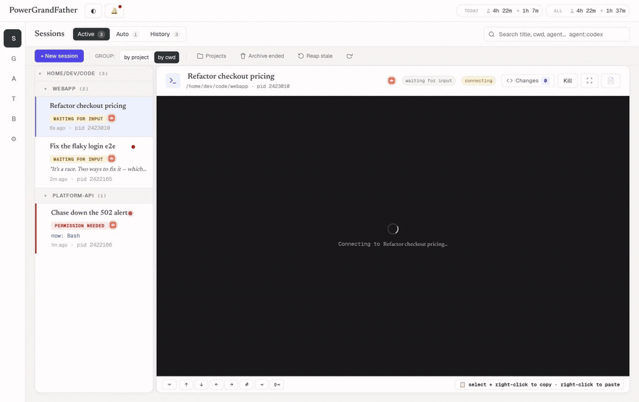
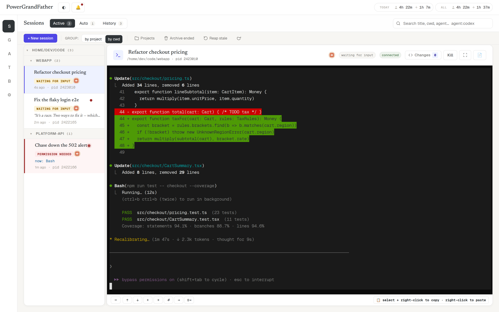
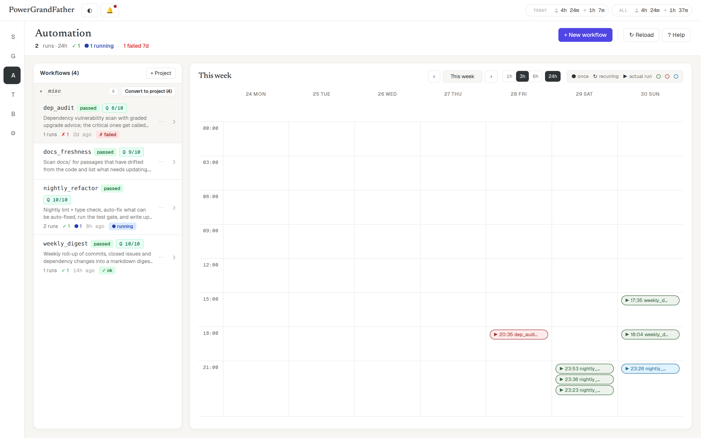
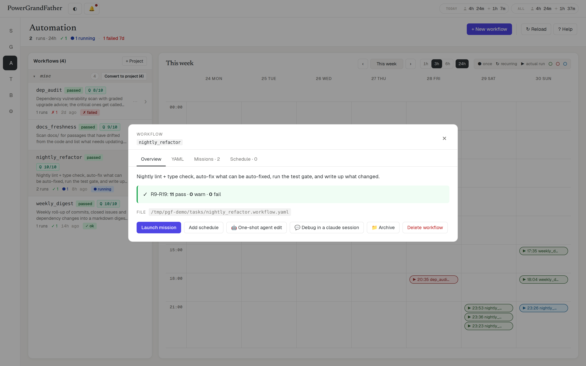
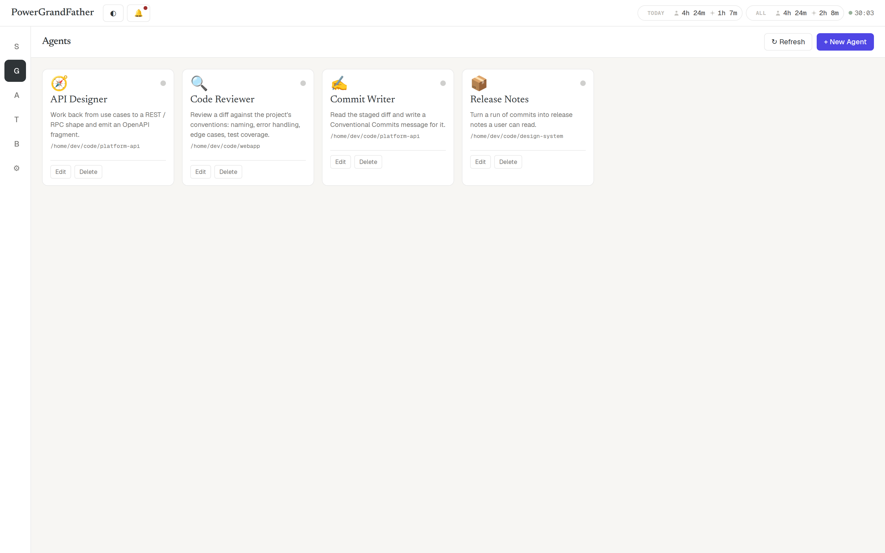
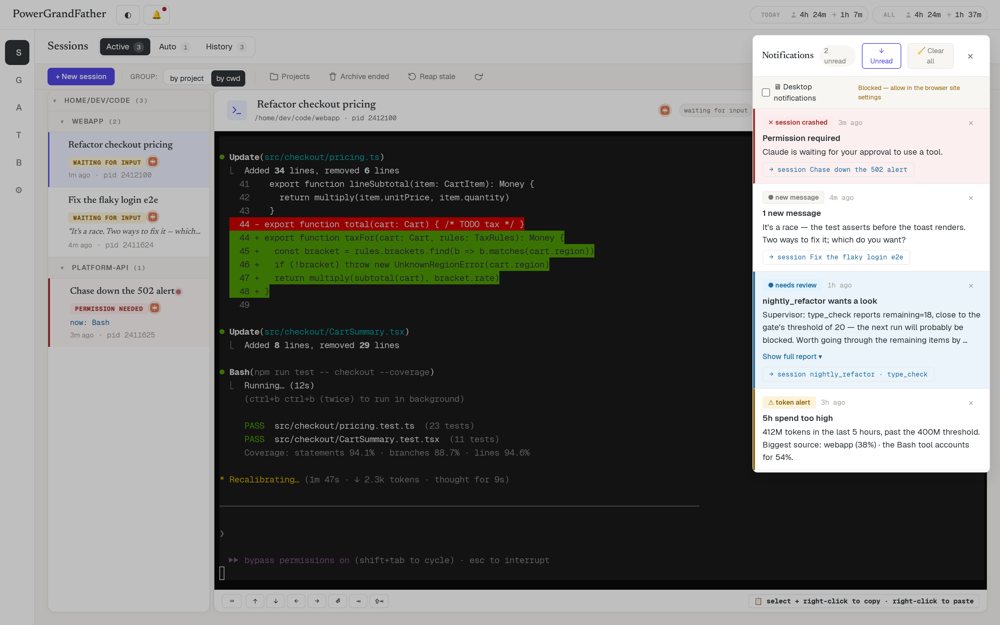
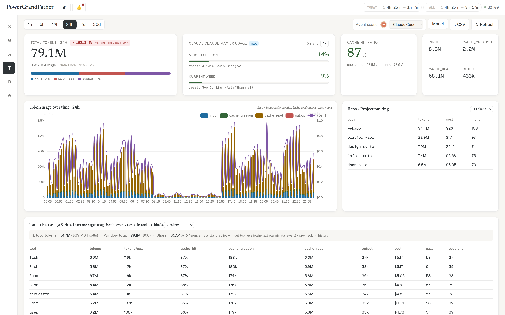
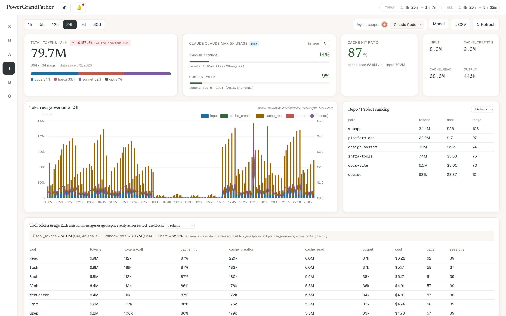
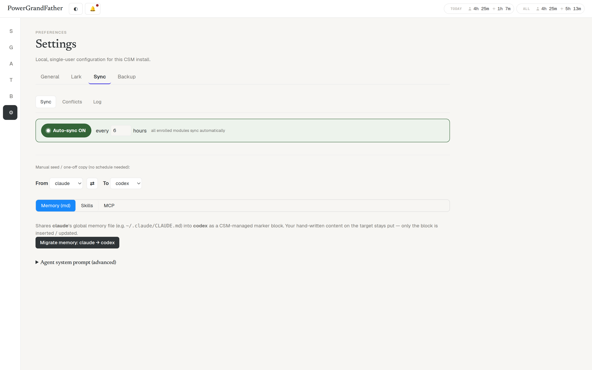
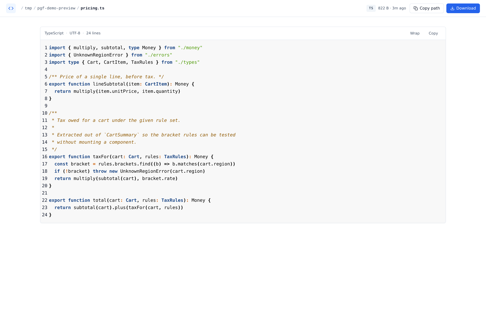

<div align="center">

# PowerGrandFather

**Claude Code 与 Codex CLI 的本地 Agent 控制台**

<sub>集中管理并行 CLI agent · 定时运行带验证的工作流 · 在手机上及时介入</sub>


<sub>[English](README.md)</sub>

</div>



---

> *"That just sounds like slavery with extra steps."*

开 5 个 tmux 窗口，挨个切过去看谁跑完了、谁崩了、谁在等你回话 —— 这就是 extra steps。

PowerGrandFather 把这些窗口收进一个页面：谁在跑、谁卡住了、谁烧了多少钱，一眼看完。更重要的是，它让 agent **在你不看的时候也能干活** —— 挂个 cron 让它每晚自己跑，跑完只有真需要你拍板的才来敲你。

## 你能用它做什么

- **一屏看住 N 个会话** —— 不用切窗口，谁崩了、谁在等你，列表上直接标出来
- **让它半夜自己干活** —— 写个多步任务挂上 cron，早上起来看结果
- **人不在电脑前也能接上话** —— 手机装成 App，权限弹窗直接在手机上点
- **知道钱烧在哪** —— 按项目 / 模型 / 工具拆开看，撞限额之前有预警

## 两个月内部实战

这不是一个周末赶出来的 dashboard demo。公开发布前，维护者已经在自己的
私有实例上持续使用 PowerGrandFather 两个月：

| 内部实战数据（截至 2026-08-31） | 结果 |
|---|---:|
| 管理过的 Claude Code / Codex 会话 | 356 |
| Agent 累计工作时间 | 350+ 小时 |
| Workflow stage 执行 | 95 / 103 成功 |
| 内部反馈 | 59 / 75 已解决 |

这些是维护者自有实例的聚合数据，不是从公开用户处采集的遥测。统计口径见
[内部实战说明](docs/dogfooding.zh-CN.md)。

## 快速开始

公开 CI 目前覆盖 Ubuntu，其他平台暂不在兼容性保证范围内。需要提前装好
Git、Python 3.11+、Node 18+、conda，以及已经登录的 Claude Code 和/或
Codex CLI。

```bash
git clone https://github.com/rickyJie/powergrandfather.git
cd powergrandfather
conda create -n csm python=3.11 -y
conda activate csm
pip install -e .
alembic upgrade head
npm --prefix frontend ci
npm --prefix frontend run build
./scripts/start.sh
```

打开 `http://localhost:8000`。停止服务：`./scripts/stop.sh`。

> **命名说明：** PowerGrandFather 是产品名。Python 包、conda 环境和
> `CSM_*` 配置项为了兼容仍沿用内部旧名 **CSM（Claude Session Manager）**；
> 两个名字指的是同一个应用。

<details>
<summary>装不上？让 AI agent 自己装</summary>

在仓库根目录把这句话丢给 Claude Code 或 Codex：

> 读一下这个仓库根目录的 `LLMS.md` §0，按顺序把 PowerGrandFather 装起来，
> 每一步用 §0 的验证命令确认，跑完告诉我可以访问的 URL。

它会自己处理 conda 环境、alembic 多头、端口冲突、前端构建失败这些常见问题。

想确认装好了：

```bash
curl -sf http://localhost:8000/api/health -H 'X-CSM-Client: 1' | head -c 80
curl -sf http://localhost:8000/ | grep -q 'id="app"' && echo "SPA OK"
```

</details>

<details>
<summary><strong>为什么叫 PowerGrandFather？</strong></summary>

Rick Sanchez 字面就是「强大的姥爷」—— 一个人 + 一艘 spaceship + 一把 portal gun，就能同时跑 N 个跨维度实验，不组团队、不装 Redis、不问许可。这个工具照他这套哲学做的：**一个进程、一个 SQLite 文件、一次搞定 N 个 agent**。你就是 Morty，姥爷替你看住那群会话。

</details>

---

## 这东西为什么存在

**CLI agent 是一个只能隔着终端窗口说话的同事。** 一个还行，三个开始记不住，八个的时候终端复用器本身成了瓶颈：你真正需要的状态 —— 谁被卡住了、这次花了多少、它昨晚干了什么 —— 不在任何一个窗口里，因为终端没有记忆，也没法在你不看的时候告诉你任何事。

下面所有设计都是把这句话当真的结果。

### 你不在的时候它也在跑

agent 最有价值的能力不是回答得更快，是**替你跑完一件你不在场的事**。这件事需要的东西比「把 prompt 挂到定时器上」多得多：

- 一个任务是**多个 stage**，不是一句 prompt —— 每个 stage 都声明自己的产物
- 每个 stage 的产物**在下一步开始前就被检查**：文件在不在、JSON 合不合 schema、报告里该有的小节是不是真写了
- 中途死了怎么办 —— 进程凭空消失、事件丢了、stage 卡住不动 —— 有个 reaper 每 30 秒对账，该重试的重试、该判死的判死，不会有任务永远挂在「运行中」
- 跑完之后，**先让一个便宜的小模型读一遍结果**，由它决定这件事值不值得把你叫醒

最后这条是全部的重点。一个每次都提醒你的自动化，只是一个更吵的 cron。

### 做减法，不做加法

上面这些需求，「标准」架构是：Postgres 存状态、Redis 做队列、Airflow 管调度、消息队列连 worker、Kubernetes 把这一切托起来。

用户只有一个。就是你。

所以：**一个 uvicorn 进程，一个 SQLite 文件。** 没有 broker，没有外部调度器，没有第二个数据存储。模块之间由类型化事件流和一条内存 pub/sub 总线连接。部署就是 `./scripts/start.sh`，备份就是 `csm.db`。想反驳这个决定，理由写在 [ADR-0002](docs/decisions/0002-single-process-monolith.md) 里。

代价是真实的，而且明说：没有多用户、没有权限模型、没有任何横向扩展。这些不在 roadmap 上 —— 它们就是这笔交易的价格。

### 它是被它自己管理的东西造出来的

这个工具的第一版不是手写的。是 Claude Code 自己写的：cron 驱动、全程无人值守、27 小时窗口，其中约 9-10 小时是真正在干活，产出了骨架、端到端修复和功能实现。过程中出了 4 个 P0/P1 bug，四个都是它自己发现、自己回滚、自己重做的。公开仓库是经过脱敏的源码快照，所以简短的 commit 历史不等于真实开发历史；可公开的时间线和统计方法整理在[内部实战说明](docs/dogfooding.zh-CN.md)里。

从那以后，每一个功能都是**用 PowerGrandFather 管着写 PowerGrandFather 的那些 Claude 会话**做出来的。这不是一句营销话术，就是开发流程本身 —— 也是为什么它的手感长成现在这样：同时跑八个 agent 时任何别扭的地方都被修掉了，因为那个同时跑八个 agent 的人正在用它开发它。

---

## 和别的工具比

这个领域有几个做得不错的工具，它们和这个不是同一件东西。下面的事实于
2026-08-31 对照各自 README 核对，判断是我的。

**[Orca](https://github.com/stablyai/orca)** —— 原生桌面 ADE（Electron，MIT）。核心思路是 **git worktree 隔离**：每个 agent 任务独占一个 worktree 和分支，可以把同一个 prompt 扇出给几个 agent，再挑一个结果 merge 掉。支持 30+ 种 CLI agent，有后台 PTY daemon、GitHub 和 Linear 集成、手机伴侣 App。它没有调度、没有无人值守执行 —— Orca 是**你坐在这儿**指挥舰队用的。

**[claudecodeui / CloudCLI](https://github.com/siteboon/claudecodeui)** —— 面向 Claude Code / Cursor CLI / Codex 的响应式 Web UI（AGPL-3.0）。remote-first：可以自托管，也有他们的托管云，手机上是真能用的。它读 `~/.claude` 而不自己存状态，Scheduler 插件可以跑 workspace 范围的定时 prompt。

**这个项目不一样的地方是无人值守那条链路的深度，不是有没有。** 定时 prompt 是一个步骤挂在定时器上；这里的一个 mission 是带产物契约的多 stage 流水线，每步验证、崩溃可恢复、并且在结果和你的通知之间还隔着一个 review agent。这一套再加上真正的事件总线和历史 —— 那才是 token 归因、预算和自然语言告警得以成立的前提 —— 就是这个项目用「在其它所有方面都更窄」换来的东西。

| | PowerGrandFather | Orca | claudecodeui |
|---|---|---|---|
| **形态** | 一个进程 + 一个浏览器标签 | 原生桌面 App | Web UI，自托管或托管云 |
| **为谁设计** | 桌前，整天 | 桌前，整天 | 手机 / 平板 / 远程 |
| **无人值守** | 多 stage mission、每步验证、自动恢复、通知前先 review | — | 定时 prompt（插件） |
| **并行隔离** | 原地，在你真实的仓库里 | **每任务一个 worktree + 分支** | 原地 |
| **历史** | SQLite + 事件总线：过往运行、token 归因、预算、自然语言告警 | 用量 + 限额读数 | 读 `~/.claude` |
| **支持的 agent** | Claude Code、Codex | **30+** | Claude Code、Cursor、Codex |
| **集成** | Lark、Prometheus | **GitHub、Linear** | — |

### 这些情况请选别的

- 你想要 **git worktree 扇出** —— 同一个 prompt 跑五份再 diff。Orca 做得很好，这个项目**完全没有**
- 你**同时用很多种 agent CLI**，想要一个统一 UI
- **手机 / 平板是主战场**，不是桌面的补充
- 你想要**托管服务**，而不是自己机器上的一个进程
- 你需要**多个人一起用**

### 这些情况可以选它

- 你**大多数时候同时开着好几个会话**
- 你想要**隔夜自己跑**的任务，并且只在 reviewer agent 认为该打扰你时才被打扰
- 你想看**上周发生了什么**和**今晚会发生什么**，而不只是屏幕上现在有什么
- 你在意 token 花在哪 —— **按仓库、按模型、按工具**
- 比起装一套栈，你更想**一个进程配一个 SQLite 文件**

### 明确不做的事

多用户、或者比一个共享 token 更复杂的权限模型 · git worktree 隔离 · 托管 / 云版本 · 配额百分比指标（原因见 [ADR-0001](docs/decisions/)）· 取代你的编辑器。

---

## 🎬 装完先做这 3 件事

**① 开第一个会话** —— Sessions 页点 `+ New session`，选个目录，选 Claude Code 还是 Codex，回车。这就是个真终端，跟你在 iTerm 里敲 `claude` 完全一样，只是现在它有人替你盯着。

**② 让它崩了会叫你** —— 什么都不用配。会话崩了、卡在权限弹窗上、跑完在等你回话，右上角铃铛都会亮。想推到手机上就去 `Settings › Lark` 填个飞书 chat id。

**③ 写第一个自动化** —— Automation 页点 `+ New workflow`，用大白话说你要什么（比如「每晚扫一遍 docs，把跟代码脱节的段落列出来」）。Agent 会反问你几句，然后自己把 YAML 写出来。点 `Launch mission` 试跑一次，满意了再 `Add schedule` 挂 cron。

---

# 功能

## 🖥 会话

> *"There's an infinite number of realities, Morty."*
> 无限多个平行宇宙，但你只有一块屏幕。

**能做什么** —— 在浏览器里开真终端跑 Claude Code / Codex，想开几个开几个。列表上直接看到每个会话是在跑、在等你、还是崩了，以及它最近碰过哪些文件。掉线重连不丢屏。



**怎么开始**

1. `+ New session` → 选工作目录 → 选 agent（Claude Code / Codex）
2. 列表左边按目录自动分组；会话多了可以拖进 Project 分桶，或者 pin 到顶上
3. 想接续之前的会话：History 标签找到它，点 `/resume`
4. 停止用 `Stop`（优雅退出，最多等 15 秒），实在不行 `Kill`

**什么时候用得上** —— 你已经在同时跑 2 个以上会话，并且开始记不清哪个窗口在干嘛的时候。

<details>
<summary>还有这些</summary>

- **终端里的文件路径能点** —— hover 变链接，点开直接预览。代码带语法高亮和行号，Markdown 渲染出来（支持数学公式），图片直接显示，还能切到 Diff 看这次改了什么
- **未读标记** —— 会话有新消息会标红；也可以手动标记「待办」，提醒自己回头看
- **崩溃自动识别** —— 进程死了状态立刻变 `crashed` 并发通知，不用你去发现
- **代理环境自动带上** —— 启动时嗅探一次代理配置，之后每个新会话都自动带

</details>

## 🎯 自动化

> *"What, so everyone's supposed to sleep every single night?"*
> 你要睡，姥爷不用。

**能做什么** —— 描述一个多步任务（跑 lint → 自己修 → 跑测试 → 出报告），挂上 cron，之后每晚它自己跑。每一步的产出都会被检查（文件在不在、字数够不够、该有的小节有没有写），过不了就不往下走。跑完还会有个小模型替你先看一眼，**只有真需要你过目的才通知你**。



**怎么开始**

1. Automation 页 → `+ New workflow`
2. 用大白话说你要什么，Agent 会反问几句把需求问清楚
3. 它写出 YAML 并自己审一遍；审不过会重写
4. `Launch mission` 试跑一次，看每一步的产出
5. 满意了 → `Add schedule` 填 cron 表达式



**什么时候用得上** —— 任何你已经在手动重复的事：每晚回归、每周周报、发版前检查清单。

<details>
<summary>还有这些</summary>

- **不满意可以让 agent 改** —— workflow 详情页有一次性的 agent 编辑，说一句要改什么就行；复杂的开个调试会话慢慢聊
- **跑之前先看看** —— `preview` 干跑一遍，看看渲染出来的 prompt 长什么样，不真的花钱
- **等外部系统** —— 除了「让 agent 干活」这种步骤，还有「等着」这种步骤：循环跑一段 shell 检查直到通过，用来等训练任务、等 CI、等别的系统
- **跑挂了会自己捞** —— 进程莫名死了、事件丢了、卡住不动了，后台每 30 秒对一次账，该重试重试该判死判死，不会有 mission 永远挂在「运行中」
- **手写 YAML 也行** —— 放进 `tasks/` 目录，然后点 `Reload`。格式见 [`docs/workflow_authoring_guide.md`](docs/workflow_authoring_guide.md)

> *"I'm not looking for judgment, just a yes or no."*
> 跑完那个 review agent 只回答一件事：这次的东西，人要不要看。

</details>

## 🧑‍💻 常驻 Agent

> *"Sometimes science is more art than science, Morty."*
> 调 prompt 就是这么回事 —— 调好了就别每次重打一遍。

**能做什么** —— 把常用的 agent（code reviewer、commit 信息生成、API 设计…）存成卡片，配好的长 prompt 不用每次重贴。每张卡片有自己独立的对话页，历史聊天都留着。



**怎么开始**

1. Agents 页 → `+ New Agent`
2. 填名字、图标、工作目录
3. Prompt 可以直接粘，也可以填一个文件路径或 URL —— 之后点 `Refresh` 就能拉最新版
4. 卡片上点一下就开始对话

**什么时候用得上** —— 有那么两三个 prompt 你已经贴过五次以上了。

## 🔔 通知

> *"Wubba lubba dub dub!"*
> 剧里这句的真实含义是「我很痛苦，请帮我」—— 会话崩了的时候就是在喊这个。

**能做什么** —— 会话崩了、卡在权限弹窗上、自动化失败了、跑完等你回话、token 快撞限额了，右上角铃铛统一收。可以推到飞书，手机上点通知直接跳到出事的那个会话。



**怎么开始**

1. 面板默认就开着，`j` / `k` 跳未读，`Esc` 关
2. 想推手机：`Settings › Lark` 填 chat id，点一下测试消息确认通了
3. 想让手机上的链接点得开：设一个 `CSM_PUBLIC_BASE_URL`

**什么时候用得上** —— 你开始离开电脑但还想知道那边跑得怎么样了。

<details>
<summary>它不会烦你</summary>

- **一轮对话只发一条** —— 同一件事有两个来源报上来，会去重
- **权限给了自动消** —— 「等你授权」那条通知，你一授权它自己标记已读，不用手动清
- **同一个问题不问第二次** —— 尤其是多 agent 同步那边，你说过一次「这两边可以不一样」，它就不再问
- **桌面通知** —— 浏览器允许的话，重要的会走系统通知弹出来

</details>

## 📊 用量与预算

> *"Don't think about it."*
> 这是唯一一件你不能 don't think about it 的事。

**能做什么** —— 看清楚 token 花在哪：按仓库、按模型、按工具三个维度拆开，加上 24 小时趋势和缓存命中率。设预算，快超了提前叫。告警规则用大白话写，agent 帮你翻译成检查脚本。



**怎么开始**

1. Tokens 页选时间范围（1h / 5h / 24h / 7d / 30d），下面三张表分别是仓库排行、工具消耗、会话明细
2. 想设预算：Budgets 页新建，选范围（全局 / 某个项目 / 某个模型…）和周期（5 小时窗口 / 天 / 周 / 月）
3. 想要更聪明的告警：Tokens 页拉到底 → `+ Custom rule` → 写一句「过去 5 小时 opus 超过 500 万 token 且缓存命中率低于 30%」→ 它生成脚本并**先拿当前数据跑一遍给你看** → 确认了才保存



**什么时候用得上** —— 第一次收到账单觉得「怎么这么多」的时候。

<details>
<summary>还有这些</summary>

- **告警能告诉你为什么** —— 规则勾上「触发时让 Agent 分析原因」，触发时它会带着诊断数据再分析一轮，给你的是「会话 abc123 在某目录里 Bash 循环烧了 480K token，opus 占了 80%，换 sonnet 能便宜 3 倍」，而不是干巴巴一句「超阈值了」
- **有现成的规则** —— 不想自己写就用预设：5h 总消耗过大 / 缓存效率变差 / 某个会话在飙 token，点「启用」就行
- **导 CSV** —— 想自己拉去分析，Tokens 页有 `↓CSV`
- **给 Grafana 抓** —— `/api/metrics` 是 Prometheus 格式
- **只有绝对值，没有「用了百分之几」** —— 官方没有稳定的配额接口，估出来的百分比会在关键时刻骗你，所以干脆不做（[ADR-0001](docs/decisions/)）

</details>

## 🔄 多 Agent 同步

> *"Peace among worlds."*
> Council of Ricks 内部先统一口径，再谈别的。

**能做什么** —— 你的 instructions（CLAUDE.md 那类）、MCP servers、skills，在 Claude Code 和 Codex 之间保持一致。改一处，其他地方跟上；真有分歧的地方拎出来让你裁决。



**怎么开始**

1. `Settings › Sync`
2. **Sync** 标签：选源和目标，勾要迁的东西，点迁移
3. **Conflicts** 标签：两边不一样的会列在这，你决定听谁的（也可以说「就让它们不一样」）
4. **Log** 标签：看什么时候同步过、同步了什么

**什么时候用得上** —— 你同时在用两个以上 CLI agent，并且已经手动 copy-paste 过配置。

<details>
<summary>两件值得知道的事</summary>

- **不需要 API key** —— 自动模式下的判断跑在你**已经登录的那个 CLI** 上，所以只用 Codex 的人也能用，不用额外买 API 额度
- **你说过的话它记得** —— 你要是决定「这两边就是要不一样」，它记下来不再问；但如果对面内容后来变了，说明情况变了，它会重新提出来

</details>

## 🧰 顺手的小东西

> *"I turned myself into a pickle, Morty!"*
> 有些东西做出来就是因为能做。

| | |
|---|---|
| **文件预览** | 终端里的路径能点开。代码高亮 + 行号，Markdown 渲染（带数学公式），HTML 全屏预览，图片直显。还能切 Diff 看这次改了啥 |
| **备份** | `Settings › Backup` 一键打包数据库 + workflow YAML，跑着的时候也能备。换机器解压恢复 |
| **工时** | 顶栏两个数：今天和累计，人的时间和 agent 的时间分开算。注意是**累加**——3 个 agent 各跑 1 分钟算 3 分钟，看的是投入量不是墙上时间 |
| **项目分桶** | 会话和 workflow 都能归到项目下，多了之后好找 |



---

## 📱 手机上用

> 通知就是 portal gun —— 手机上点一下，直接落到出事那个会话里。

有一套独立的移动端界面（`/m/`），是完整的 PWA：加到主屏幕后全屏、有图标、没有地址栏，跟原生 App 一样。**iOS 和 Android 用同一套**，不用上架、不用签名。

**怎么开始**

```bash
./mobile/scripts/start_with_mobile.sh     # 桌面端和手机端一起服务
```

然后：

1. **设个 token** —— `export CSM_ACCESS_TOKEN=$(openssl rand -hex 24)`
2. **搞个真证书** —— iOS 的 PWA 要求受信任的 HTTPS，**自签会被拦**。最省事是 Caddy 一行 `reverse_proxy 127.0.0.1:8000` 配 Let's Encrypt
3. **手机打开** `https://<你的域名>/m/?token=<刚才那个 token>` —— token 会种进 cookie，之后免输入
4. **加到主屏幕** —— iOS：Safari 分享 →「添加到主屏幕」；Android：Chrome 菜单 →「安装应用」

手机端是**会话陪伴**定位：收发消息、看流式输出、点权限弹窗、回多选提问。不做 token 图表和 workflow 编排 —— 那些留在桌面。

<details>
<summary>不想暴露公网？走 SSH 隧道（Android / iOS 各一个方案）</summary>

如果你不想架反代 / 暴露公网，可以让手机通过 SSH 本地端口转发（`-L`）够到绑在 `127.0.0.1:8000` 的后端，再用浏览器访问。两端各有现成方案：

- **Android** —— 仓库里的 `pgf-connector` 客户端把 SSH 隧道打包进去自动拉起、内置 WebView，装上填好主机就能用，不用手敲 `ssh -L`。它只是个便利封装，不是主线，上面的 HTTPS 方案 Android 一样能走。
- **iOS** —— 用开源的 **sshview**（[GitHub](https://github.com/lithium0003/sshview) · [App Store](https://apps.apple.com/us/app/sshview/id1620680161)，免费，LGPL-2.1）：它本身就是「SSH 端口转发 + 内置 web viewer」，把服务器类型设成 WebBrowser、转发到 `8000` 就能在内置浏览器里看 CSM，正好对口。
  > iOS 会在 App 切后台 / 锁屏后很快挂起隧道，把它当**前台使用 + 断线重连**的工具，别指望后台长活。

**手机端排障**

| 症状 | 原因 |
|---|---|
| 打不开 | 后端只绑了 `127.0.0.1`，手机连不上，需要反代或隧道 |
| 没有「安装应用」选项 | 不是受信任的 HTTPS，PWA 装不了 |
| 返回 401 | token 设了但链接没带 `?token=` |
| 一直 disconnected | 隧道断了，先看后端还活着没 |
| 界面还是旧的 | Service Worker 缓存，强制刷新或重装 |

</details>

---

## ⚙️ 常用配置

环境变量都是 `CSM_` 开头：

| 变量 | 默认 | 干什么的 |
|---|---|---|
| `CSM_HOST` / `CSM_PORT` | `127.0.0.1` / `8000` | 监听地址，默认只有本机能访问 |
| `CSM_ACCESS_TOKEN` | 空 | 访问口令，**一旦不只本机能访问就必须设** |
| `CSM_PUBLIC_BASE_URL` | 空 | 通知里链接用的外部地址（手机要点得开就得设） |
| `CSM_DB_PATH` | `csm.db` | 数据库位置。一个数据库只能有一个后端 |
| `CSM_CLAUDE_ARGV` | 空 | 测试时设成 `bash -i` 顶掉真的 `claude`，别烧真 token |

完整清单见 [`LLMS.md`](LLMS.md) 的配置章节。

> [!WARNING]
> *"To live is to risk it all."* —— 但这个险不值得冒。
>
> **这是单用户本地工具，没有权限模型。** 默认只绑 `127.0.0.1`，想远程访问最省事是 SSH 隧道（VSCode 端口转发或 `ssh -L`）。如果你显式绑到 `0.0.0.0` 暴露到局域网，**同网段任何人都能通过它拉起任意进程、读你整个文件系统**。真要这么干，先设 `CSM_ACCESS_TOKEN`，并且别在不可信的网络上开。
>
> <sub>*你要是暴露在 LAN 上被隔壁工位打死了，那也不能怪姥爷, Morty。*</sub>

---

## ❓ FAQ

<details>
<summary><strong>它会替我调用 Claude API 吗？会不会额外花钱？</strong></summary>

不会。它跑的就是你本机的 `claude` / `codex` 命令行，用的是你自己的登录态和额度。CSM 本身不持有 API key。

唯一的例外是自动化跑完的那个「要不要叫人看」的判断，用的是便宜的小模型，一次几乎不要钱，而且可以关掉。

</details>

<details>
<summary><strong>能多个人一起用吗？</strong></summary>

不能。没有用户系统、没有权限隔离，一个数据库对应一个人。这是刻意的取舍 —— 见 [ADR-0002](docs/decisions/0002-single-process-monolith.md)。

</details>

<details>
<summary><strong>为什么第二个后端起不来？</strong></summary>

一个数据库只允许一个后端。两个进程抢同一个 SQLite 会把未读数、会话绑定这些搞乱，所以启动时会加锁并直接拒绝第二个，还会告诉你是哪个进程占着。

真要同时跑两个，给它们不同的 `CSM_DB_PATH`。

</details>

<details>
<summary><strong>关掉浏览器，会话会死吗？</strong></summary>

不会。会话是后端 fork 出来的独立进程，浏览器只是个显示器。关了标签页、重启浏览器、换台机器连过来，会话都还在跑，1 MB 的回滚缓冲保证你重连之后还能看到之前的输出。

</details>

<details>
<summary><strong>数据存在哪？怎么搬走？</strong></summary>

全在项目根目录的 `csm.db` 一个 SQLite 文件里，加上 `tasks/` 下的 workflow YAML。`Settings › Backup` 能打包下载，换机器解压 + `alembic upgrade head` 就恢复了。

</details>

<details>
<summary><strong>只支持 Claude Code 吗？</strong></summary>

还支持 Codex CLI，开会话时下拉选。两者在界面上是一样的用法。想接别的 CLI 见 [`docs/backends/adding_a_new_adapter.md`](docs/backends/)。

</details>

---

## 📚 更多文档

| 想看的 | 去哪 |
|---|---|
| **它内部怎么工作的**（事件流 / 状态机 / 生命周期 / 扩展点） | [`LLMS.md`](LLMS.md) — 给大模型也给人看 |
| 架构图 + 模块依赖 + 数据流 | [`docs/architecture.md`](docs/architecture.md) |
| 每个接口的 curl 例子 | [`docs/USAGE.md`](docs/USAGE.md) |
| 怎么写 workflow YAML | [`docs/workflow_authoring_guide.md`](docs/workflow_authoring_guide.md) |
| 接一个新的 CLI | [`docs/backends/`](docs/backends/) |
| 为什么这么设计 | [`docs/decisions/`](docs/decisions/) |
| 已知的坑 | [`docs/known_issues.md`](docs/known_issues.md) |

<sub>上面的截图可以用 `./scripts/shoot_docs.sh` 重拍 —— 它灌一份虚构数据、起一个一次性后端、截完就拆，不碰你的真实数据库。</sub>

---

## 许可证

MIT —— 见 [LICENSE](LICENSE)。

<div align="center">
<sub><em>"Peace among worlds, Morty."</em></sub>
</div>
